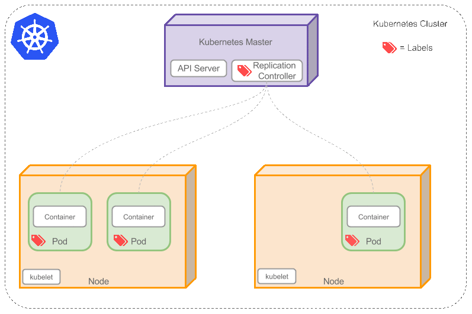
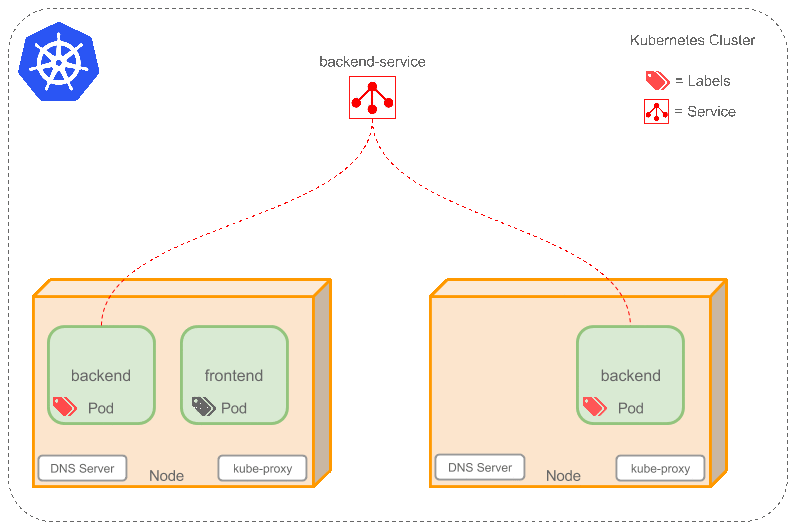

<!-- MarkdownTOC -->

- [Cluster concepts](#cluster-concepts)
  - [Namespaces](#namespaces)
- [集群](#%E9%9B%86%E7%BE%A4)
  - [Replication Controller](#replication-controller)
  - [Service](#service)
  - [Node](#node)
  - [Kubernetes Master](#kubernetes-master)
  - [References](#references)

<!-- /MarkdownTOC -->

# Cluster concepts
### Namespaces
1. Who is in a namespace scope?

* deployment
* pods
* services
* configmap

2. who is global scope?

* node ports
* node IP

# 集群

集群是一组节点，这些节点可以是物理服务器或者虚拟机，之上安装了Kubernetes平台。下图展示这样的集群。注意该图为了强调核心概念有所简化。这里可以看到一个典型的Kubernetes架构图。

上图可以看到如下组件，使用特别的图标表示Service和Label：
* Pod
* Container（容器）
* Label(label)（标签）
* Replication Controller（复制控制器）
* Service（enter image description here）（服务）
* Node（节点）
* Kubernetes Master（Kubernetes主节点）

### Replication Controller

当创建Replication Controller时，需要指定两个东西：
* Pod模板：用来创建Pod副本的模板
* Label：Replication Controller需要监控的Pod的标签。

### Service
如果Pods是短暂的，那么重启时IP地址可能会改变，怎么才能从前端容器正确可靠地指向后台容器呢？

Service是定义一系列Pod以及访问这些Pod的策略的一层抽象。Service通过Label找到Pod组。因为Service是抽象的，所以在图表里通常看不到它们的存在，这也就让这一概念更难以理解。

现在，假定有2个后台Pod，并且定义后台Service的名称为‘backend-service’，lable选择器为（tier=backend, app=myapp）。backend-service 的Service会完成如下两件重要的事情：

* 会为Service创建一个本地集群的DNS入口，因此前端Pod只需要DNS查找主机名为 ‘backend-service’，就能够解析出前端应用程序可用的IP地址。
* 现在前端已经得到了后台服务的IP地址，但是它应该访问2个后台Pod的哪一个呢？Service在这2个后台Pod之间提供透明的负载均衡，会将请求分发给其中的任意一个（如下面的动画所示）。通过每个Node上运行的代理（kube-proxy）完成。这里有更多技术细节。

下述动画展示了Service的功能。注意该图作了很多简化。如果不进入网络配置，那么达到透明的负载均衡目标所涉及的底层网络和路由相对先进。如果有兴趣，这里有更深入的介绍

有一个特别类型的Kubernetes Service，称为'LoadBalancer'，作为外部负载均衡器使用，在一定数量的Pod之间均衡流量。比如，对于负载均衡Web流量很有用。

### Node

节点（上图橘色方框）是物理或者虚拟机器，作为Kubernetes worker，通常称为Minion。每个节点都运行如下Kubernetes关键组件：

* Kubelet：是主节点代理。
* Kube-proxy：Service使用其将链接路由到Pod，如上文所述。
* Docker或Rocket：Kubernetes使用的容器技术来创建容器。

### Kubernetes Master

集群拥有一个Kubernetes Master（紫色方框）。Kubernetes Master提供集群的独特视角，并且拥有一系列组件，比如Kubernetes API Server。

API Server提供可以用来和集群交互的REST端点。master节点包括用来创建和复制Pod的Replication Controller。

### References
[十分钟带你理解Kubernetes核心概念](http://www.dockone.io/article/932) 

[《Kubernetes权威指南》——Kubelet运行机制与安全机制](https://www.cnblogs.com/suolu/p/6841848.html) 

[闲谈Kubernetes 的主要特性和经验分享](https://www.oschina.net/question/2432428_246729) 

[Interactive Tutorial - Creating a Cluster](https://kubernetes.io/docs/tutorials/kubernetes-basics/create-cluster/cluster-interactive/) 

[Tutorials: hello minikube](https://kubernetes.io/docs/tutorials/hello-minikube/) 

 

 
