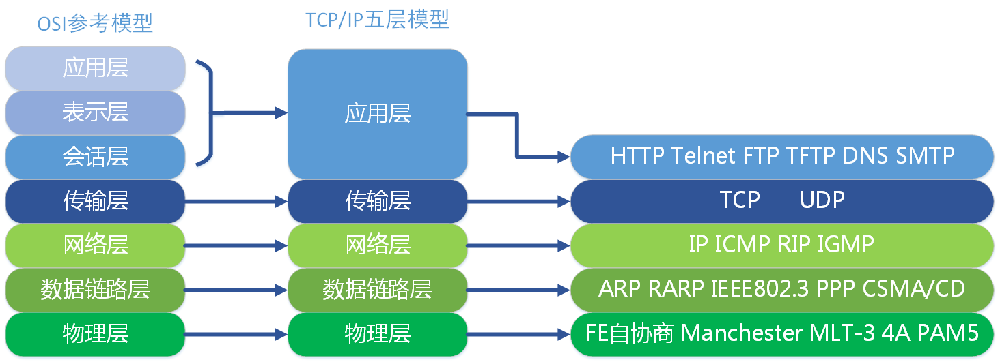
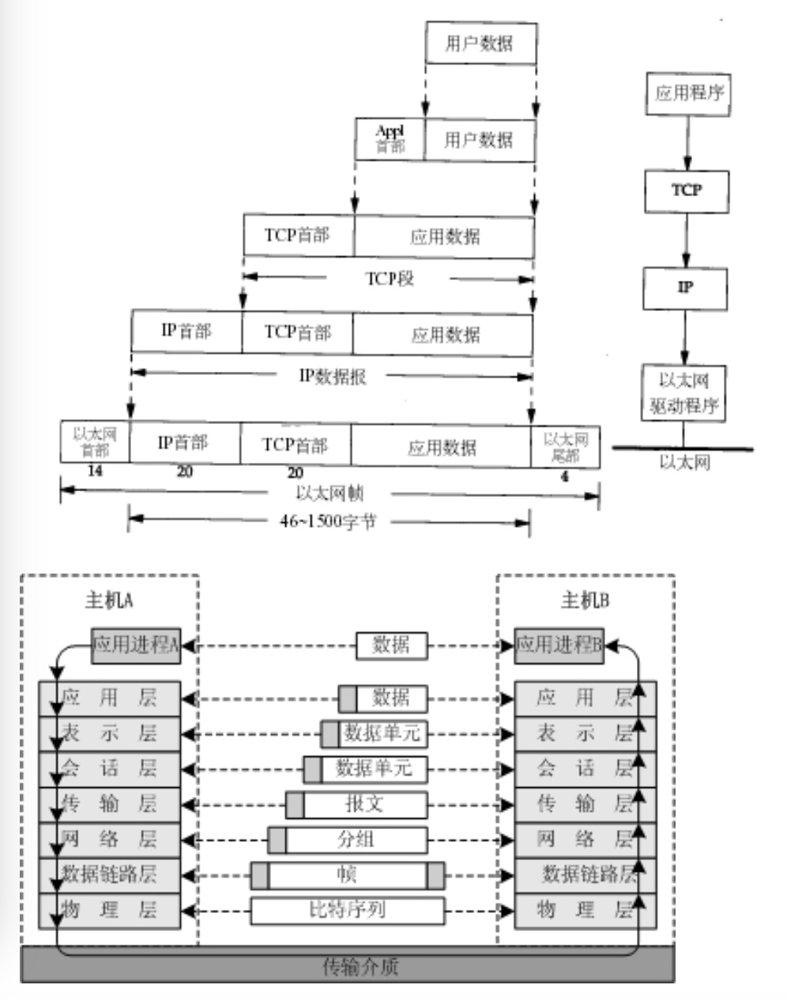

OSI七层模型与TCP/IP五层模型
___
博主是搞是个FPGA的，一直没有真正的研究过以太网相关的技术，现在终于能静下心学习一下，希望自己能更深入的掌握这项最基本的通信接口技术。下面就开始搞了。
# OSI参考模型
今天我们先学习一下以太网最基本也是重要的知识——OSI参考模型。
## OSI的来源
  OSI（Open System Interconnect），即开放式系统互联。 一般都叫OSI参考模型，是ISO（国际标准化组织）组织在1985年研究的网络互连模型。 
  ISO为了更好的使网络应用更为普及，推出了OSI参考模型。其含义就是推荐所有公司使用这个规范来控制网络。这样所有公司都有相同的规范，就能互联了。
## OSI七层模型的划分
  OSI定义了网络互连的七层框架（物理层、数据链路层、网络层、传输层、会话层、表示层、应用层），即ISO开放互连系统参考模型。如下图。 
  每一层实现各自的功能和协议，并完成与相邻层的接口通信。OSI的服务定义详细说明了各层所提供的服务。某一层的服务就是该层及其下各层的一种能力，它通过接口提供给更高一层。各层所提供的服务与这些服务是怎么实现的无关。
 
## 各层功能定义
这里我们只对OSI各层进行功能上的大概阐述，不详细深究，因为每一层实际都是一个复杂的层。后面我也会根据个人方向展开部分层的深入学习。这里我们就大概了解一下。我们从最顶层——应用层 开始介绍。整个过程以公司A和公司B的一次商业报价单发送为例子进行讲解。
### 应用层
OSI参考模型中最靠近用户的一层，是为计算机用户提供应用接口，也为用户直接提供各种网络服务。我们常见应用层的网络服务协议有：HTTP，HTTPS，FTP，POP3、SMTP等。 
**实际公司A的老板就是我们所述的用户，而他要发送的商业报价单，就是应用层提供的一种网络服务，当然，老板也可以选择其他服务，比如说，发一份商业合同，发一份询价单，等等。**

### 表示层
表示层提供各种用于应用层数据的编码和转换功能,确保一个系统的应用层发送的数据能被另一个系统的应用层识别。如果必要，该层可提供一种标准表示形式，用于将计算机内部的多种数据格式转换成通信中采用的标准表示形式。数据压缩和加密也是表示层可提供的转换功能之一。 
**由于公司A和公司B是不同国家的公司，他们之间的商定统一用英语作为交流的语言，所以此时表示层（公司的文秘），就是将应用层的传递信息转翻译成英语。同时为了防止别的公司看到，公司A的人也会对这份报价单做一些加密的处理。这就是表示的作用，将应用层的数据转换翻译等。**

### 会话层
会话层就是负责建立、管理和终止表示层实体之间的通信会话。该层的通信由不同设备中的应用程序之间的服务请求和响应组成。 
**会话层的同事拿到表示层的同事转换后资料，（会话层的同事类似公司的外联部），会话层的同事那里可能会掌握本公司与其他好多公司的联系方式，这里公司就是实际传递过程中的实体。他们要管理本公司与外界好多公司的联系会话。当接收到表示层的数据后，会话层将会建立并记录本次会话，他首先要找到公司B的地址信息，然后将整份资料放进信封，并写上地址和联系方式。准备将资料寄出。等到确定公司B接收到此份报价单后，此次会话就算结束了，外联部的同事就会终止此次会话。**

### 传输层 (port for process)
传输层建立了主机端到端的链接，传输层的作用是为上层协议提供端到端的可靠和透明的数据传输服务，包括处理差错控制和流量控制等问题。该层向高层屏蔽了下层数据通信的细节，使高层用户看到的只是在两个传输实体间的一条主机到主机的、可由用户控制和设定的、可靠的数据通路。我们通常说的，TCP UDP就是在这一层。端口号既是这里的“端”。 
**传输层就相当于公司中的负责快递邮件收发的人，公司自己的投递员，他们负责将上一层的要寄出的资料投递到快递公司或邮局。**

### 网络层 (IP address)
本层通过IP寻址来建立两个节点之间的连接，为源端的运输层送来的分组，选择合适的路由和交换节点，正确无误地按照地址传送给目的端的运输层。就是通常说的IP层。这一层就是我们经常说的IP协议层。IP协议是Internet的基础。 
**网络层就相当于快递公司庞大的快递网络，全国不同的集散中心，比如说，从深圳发往北京的顺丰快递（陆运为例啊，空运好像直接就飞到北京了），首先要到顺丰的深圳集散中心，从深圳集散中心再送到武汉集散中心，从武汉集散中心再寄到北京顺义集散中心。这个每个集散中心，就相当于网络中的一个IP节点。**

### 数据链路层 (ethernet mac address)
将比特组合成字节,再将字节组合成帧,使用链路层地址 (以太网使用MAC地址)来访问介质,并进行差错检测。 
数据链路层又分为2个子层：逻辑链路控制子层（LLC）和媒体访问控制子层（MAC）。 
MAC子层处理CSMA/CD算法、数据出错校验、成帧等；LLC子层定义了一些字段使上次协议能共享数据链路层。 在实际使用中，LLC子层并非必需的。 
这个没找到合适的例子

### 物理层     
实际最终信号的传输是通过物理层实现的。通过物理介质传输比特流。规定了电平、速度和电缆针脚。常用设备有（各种物理设备）集线器、中继器、调制解调器、网线、双绞线、同轴电缆。这些都是物理层的传输介质。 
**快递寄送过程中的交通工具，就相当于我们的物理层，例如汽车，火车，飞机，船。**

## 通信特点：对等通信      
对等通信，为了使数据分组从源传送到目的地，源端OSI模型的每一层都必须与目的端的对等层进行通信，这种通信方式称为对等层通信。在每一层通信过程中，使用本层自己协议进行通信。
 

# TCP/IP五层模型
TCP/IP五层协议和OSI的七层协议对应关系如下。

 

在每一层都工作着不同的设备，比如我们常用的交换机就工作在数据链路层的，一般的路由器是工作在网络层的。

 

在每一层实现的协议也各不同，即每一层的服务也不同.下图列出了每层主要的协议。其中每层中具体的协议，我会在后面的逐一学习。

 

### HTTP packets
 

# 参考文献：
1.百度百科：OSI参考模型

2.http://blog.csdn.net/wdkirchhoff/article/details/43915825
