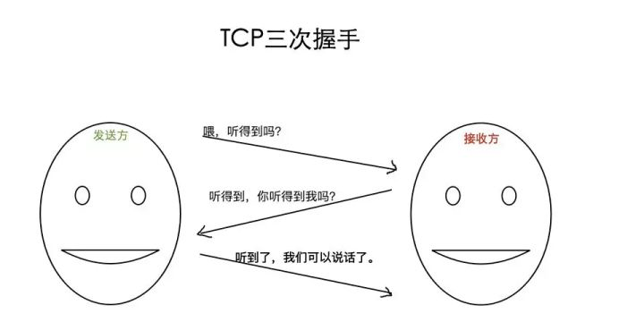
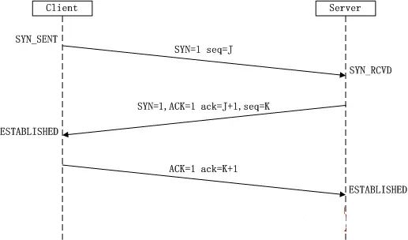
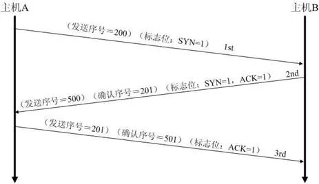
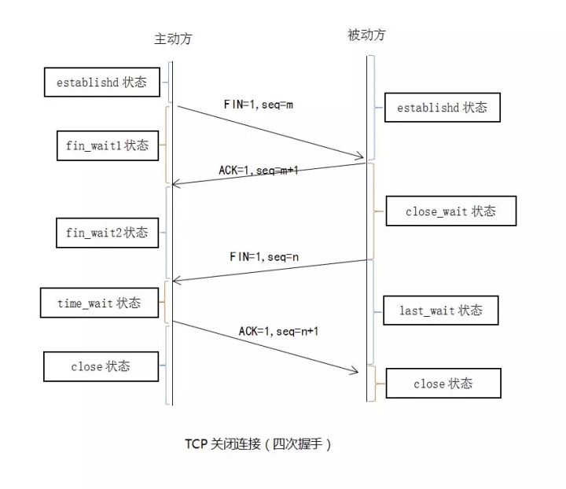

# Connection establishment
---
To establish a connection, TCP uses a three-way handshake.
* __SYN__: The active open is performed by the client sending a SYN to the server.
* __SYN-ACK__: In response, the server replies with a SYN-ACK.
* __ACK__: Finally, the client sends an ACK back to the server. 

### Why
TCP建立连接为什么是三次握手，而不是两次或四次？
举个日常例子，打电话时我们对话如下：
 

 
 

# Connection termination
---
The connection termination phase uses a four-way handshake, with __each side of the connection terminating independently__. 

 

# References
[wiki/Transmission_Control_Protocol](https://en.wikipedia.org/wiki/Transmission_Control_Protocol) 

 

 

 

 
