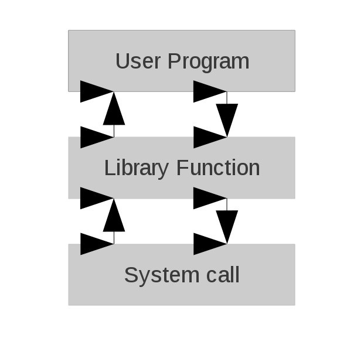

<!-- MarkdownTOC -->

- [Techs](#techs)
  - [Library function hook and system calls](#library-function-hook-and-system-calls)
- [References](#references)

<!-- /MarkdownTOC -->

# Techs
### [Library function hook and system calls](https://opensourceforu.com/2011/08/lets-hook-a-library-function/)

Please look at Figures 1 and 2 for a graphical representation of what happens when a library function is hooked.

* Figure 1: Library function



* Figure 2: Library function with hook


__Now let’s look at hooking a library function.__

1. The simple `prog1.c` program below just allocates 10 bytes of memory from the heap, and frees it:

```
#include<stdio.h>
#include<malloc.h>
#include<stdlib.h>
int main(void)
{
    int *p;
    printf("calling from main...\n");
    p=(int *)malloc(10);
    if(!p)
    {
        printf("Got allocation error...\n");
        exit(1);
    }
    printf("returning to main...\n");
    free(p);                           /* freeing memory from heap */
    printf("freeing memory...\n");
    return 0;
}
```

When we compile and run the above program, the output is as shown below:
```
[root@workbenchsvr malloc_hook]# gcc -o prog1 prog1.c
[root@workbenchsvr malloc_hook]# ./prog1
calling from main...
returning to main...
freeing memory...
[root@workbenchsvr malloc_hook]#
```

2. The next program, called `prog2.c`, is a simple hook for the `malloc()` function:

```
#define _GNU_SOURCE
#include <stdio.h>
#include <stdint.h>
#include <dlfcn.h>                               /* header required for dlsym() */
 
/* lcheck() is for memory leak check; its code is not shown
 here */
void lcheck(void);
void* malloc(size_t size)
{
    static void* (*my_malloc)(size_t) = NULL;
    printf("inside shared object...\n");
    if (!my_malloc)
    my_malloc = dlsym(RTLD_NEXT, "malloc");  /* returns the object reference for malloc */
    void *p = my_malloc(size);               /* call malloc() using function pointer my_malloc */ 
    printf("malloc(%d) = %p\n", size, p);
    lcheck();                                /* calling do_your_stuff function */
    printf("returning from shared object...\n");
    return p;
}
void lcheck(void)
{
    printf("displaying memory leaks...\n");
    /* do required stuff here */
}
```

Compiling and running the above, goes like this:
```
[root@workbenchsvr malloc_hook]# gcc -shared -ldl -fPIC prog2.c -o libprog2.so
[root@workbenchsvr malloc_hook]# LD_PRELOAD=/home/dibyendu/malloc_hook/libprog2.so ./prog1
calling from main...
inside shared object...
malloc(10) = 0x8191008
displaying memory leaks...
returning from shared object...
returning to main...
freeing memory...
[root@workbenchsvr malloc_hook]#
```

So, let’s take a closer look at our first hook. The `dlsym()` function takes two parameters: the first is a handle returned by `dlopen()`. Here, we must use `RTLD_NEXT` for function interposition.

This tells the dynamic linker to find the next reference to the specified function, not the one that is calling `dlsym()`.


# References
[Linux中创建Daemon进程的三种方法](https://www.cnblogs.com/minico/p/7702020.html)<br/>

[linux下curl的地址使用双引号引用的原因](http://www.mamicode.com/info-detail-24779.html)<br/>
* 原因在于加上双引号可以防止转义，在linux中使用&会使进程后台运行
* 必须对&进行转义，加反斜杠的方式比较麻烦，故使用双引号模式最方便。

[]()<br/>

[]()<br/>

[]()<br/>

[]()<br/>

[]()<br/>
