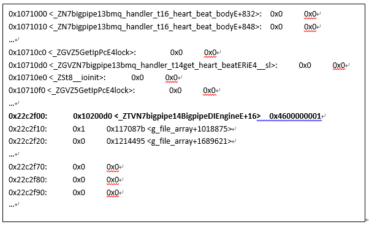

# The Process of figure out memory leak issue
### Issue
The memory of one server is always increasing and higher than others.

### Suspect
Some kind of memory leak maybe happen or some kind of traffic should be different from other servers, because service binary and conf are same with other servers.

### Process
利用gdb打印内存信息并从信息中观察可能的内存泄漏点。

1. pmap -x {PID}
如：pmap -x 24671；得到类似如下信息，注意标记为anon的位置：


2. 启动gdb ./bin/broker并使用 attach {PID}命令加载现有进程
例如上述进程号为24671，则使用：attach 24671；

3. 使用setheight 0和 setlogging on开启gdb日志
日志将存储于gdb.txt文件中；

4. 使用x/{内存字节数}a {内存地址} 打印出一段内存信息
例如上述的anon为堆头地址，占用了144508kb内存，则使用：x/18497024a0x000000000109d000；
若命令行较多，可以在外围编辑好命令行直接张贴至gdb命令行提示符中运行，或者将命令行写到一个文本文件中，例如command.txt中，
然后再gdb命令行提示符中使用 source command.txt来执行文件中的命令集合，下面是command.txt文件的内容:


5. 分析gdb.txt文件中的信息，gdb.txt中的内容如下：


Gdb.txt中内容的说明和分析：第一列为当前内存地址，如0x22c2f00；第二、三、四列分别为当前内存地址对应所存储的值（使用十六进制表示），以及gdb的debug的符号信息，例如：0x10200d0<_ZTVN7bigpipe15BigpipeDIEngineE+16> 0x4600000001，分别表示：“前16字节”、“符号信息（注意有+16的偏移）”、“后16字节”，但不是所有地址都会打印gdb的debug符号信息，有时符号信息显示在第三列，有时显示在第二列。

....

### Some commands
* strings<br/>

```
strings /usr/lib64/libmyodbc5w.so | grep "GLIBC\|lib"
libodbc.so.2
libmysqlclient.so.18
libpthread.so.0
libm.so.6
libodbcinst.so.2
libdl.so.2
libc.so.6
libmyodbc5w.so
GLIBC_2.2.5
GLIBC_2.3
GLIBC_2.14
GLIBC_2.4
GLIBC_2.3.4
libmysqlclient_18
```

* ldd
```
ldd /usr/lib64/libmyodbc5w.so
    linux-vdso.so.1 =>  (0x00007ffc5a9cc000)
    libodbc.so.2 => /lib64/libodbc.so.2 (0x00007f85e58e8000)
    libmysqlclient.so.18 => /usr/lib64/mysql/libmysqlclient.so.18 (0x00007f85e53e8000)
    libpthread.so.0 => /lib64/libpthread.so.0 (0x00007f85e51cb000)
    libm.so.6 => /lib64/libm.so.6 (0x00007f85e4ec9000)
    libodbcinst.so.2 => /lib64/libodbcinst.so.2 (0x00007f85e4cb7000)
    libdl.so.2 => /lib64/libdl.so.2 (0x00007f85e4ab2000)
    libc.so.6 => /lib64/libc.so.6 (0x00007f85e46f1000)
    libltdl.so.7 => /lib64/libltdl.so.7 (0x00007f85e44e7000)
    libz.so.1 => /lib64/libz.so.1 (0x00007f85e42d0000)
    libssl.so.10 => /lib64/libssl.so.10 (0x00007f85e4062000)
    libcrypto.so.10 => /lib64/libcrypto.so.10 (0x00007f85e3c78000)
    libstdc++.so.6 => /lib64/libstdc++.so.6 (0x00007f85e396e000)
    /lib64/ld-linux-x86-64.so.2 (0x00007f85e5db6000)
    libgssapi_krb5.so.2 => /lib64/libgssapi_krb5.so.2 (0x00007f85e3720000)
    libkrb5.so.3 => /lib64/libkrb5.so.3 (0x00007f85e3438000)
    libcom_err.so.2 => /lib64/libcom_err.so.2 (0x00007f85e3234000)
    libk5crypto.so.3 => /lib64/libk5crypto.so.3 (0x00007f85e3002000)
    libgcc_s.so.1 => /lib64/libgcc_s.so.1 (0x00007f85e2deb000)
    libkrb5support.so.0 => /lib64/libkrb5support.so.0 (0x00007f85e2bdc000)
    libkeyutils.so.1 => /lib64/libkeyutils.so.1 (0x00007f85e29d8000)
    libresolv.so.2 => /lib64/libresolv.so.2 (0x00007f85e27bd000)
    libselinux.so.1 => /lib64/libselinux.so.1 (0x00007f85e2596000)
    libpcre.so.1 => /lib64/libpcre.so.1 (0x00007f85e2334000)
```

### References
There is one memory leak bug in mysql-connector-odbc-5.2.5-6.el7.x86_64,
described in https://bugs.mysql.com/bug.php?id=70113
<br/>
[利用进程信息追查内存泄漏](https://blog.csdn.net/baidu_mtc/article/details/50504608)

<br/>


<br/>


<br/>


<br/>


<br/>
